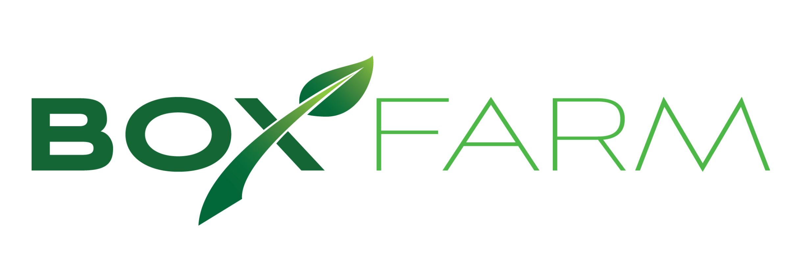
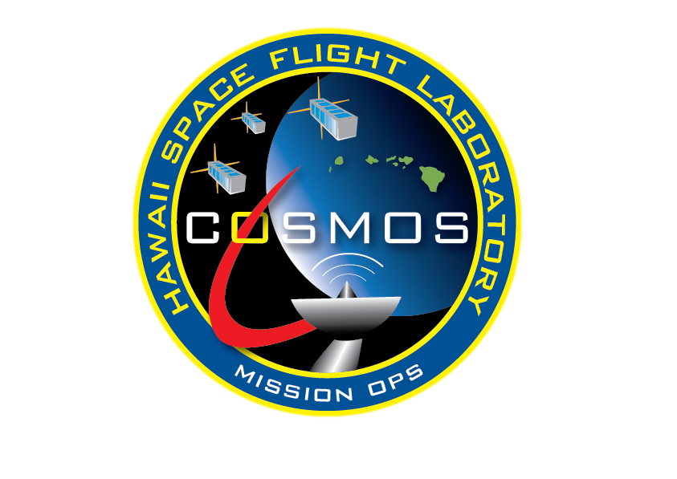

# Box Farm:seedling:.. in Space!:milky_way:

The Box Farm is an autonomous indoor hydroponic system. Here is a repository for remote monitoring using the Comprehensive Open-architecture Solution for Mission Operations Systems ([COSMOS](http://cosmosproject.org/)).

## Features to be added which may be useful for similar projects using:
* Remote monitoring using a space-grade mission control architecture :satellite:
* Sensor data collection and storage.

For all questions contact: jthesken@hawaii.edu

Box Farm             |  COSMOS
:-------------------------:|:-------------------------:
  |  
